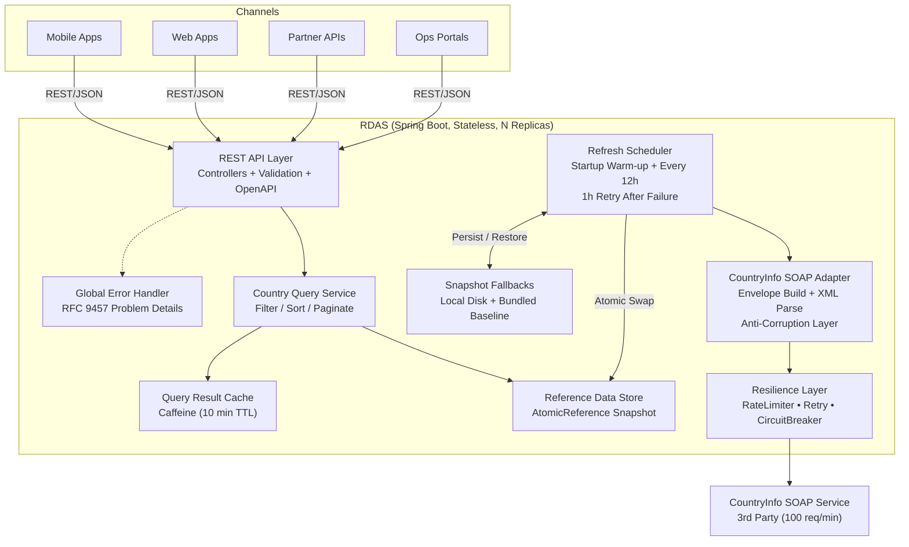
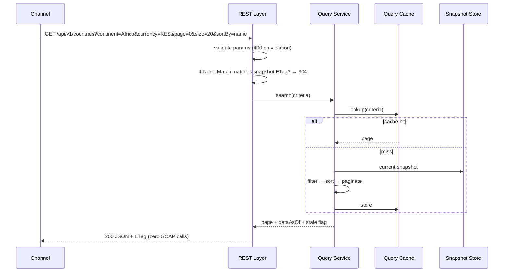

# Reference Data Aggregation Service (RDAS) — Architecture Document

|             |                                                |
| ----------- | ---------------------------------------------- |
| **Service** | Reference Data Aggregation Service (RDAS)      |
| **Team**    | Digital Business — LOOP DFS                    |
| **Status**  | Approved for build                             |
| **Version** | 1.2                                            |
| **Stack**   | Java 21, Spring Boot 3.5.x, Maven, Kubernetes (see `implementation.md` §1) |

---

## 1. Purpose and Context

Multiple channels at LOOP DFS — mobile apps, web apps, partner APIs and internal operations portals — need country, currency, language and geographical reference data. Today each channel integrates **directly** with the third-party `CountryInfoService` SOAP API. This has produced inconsistent responses across channels, poor performance from repeated SOAP round-trips, no filtering, pagination, auditability or centralized caching, and SOAP credentials scattered across many applications.

RDAS is a new internal service that becomes the **single source of truth** for country reference data. It exposes modern REST/JSON APIs to all channels and is the **only** component in the estate that talks to the SOAP provider.

```
Before:  [Mobile] ──SOAP──┐
         [Web]    ──SOAP──┼──► CountryInfo SOAP (3rd party)
         [Partner]──SOAP──┤
         [Ops]    ──SOAP──┘

After:   [Mobile] ──REST──┐
         [Web]    ──REST──┼──► RDAS ──SOAP──► CountryInfo SOAP (3rd party)
         [Partner]──REST──┤      ▲
         [Ops]    ──REST──┘   in-memory snapshot + cache
```

### 1.1 Goals

- Single, consistent REST/JSON contract for all channels.
- Rich querying: search by name, filter by continent / currency / language, pagination, sorting.
- Drastically reduced SOAP traffic (provider limit: **100 requests/minute**).
- Resilience to extended SOAP provider outages (target: survive a 6-hour outage with no consumer-visible impact).
- Centralized credentials, caching, auditing and observability.

### 1.2 Non-Goals

- RDAS does not allow writes; the upstream provider owns the data.
- RDAS does not attempt real-time freshness. Country reference data changes on the order of **months or years**, and the design exploits this aggressively.

---

## 2. The Key Architectural Insight

The business requirement (single search API with name/continent/currency/language filters, pagination and sorting) cannot be satisfied by any single SOAP operation — the provider only offers narrow lookups (`CapitalCity`, `CountryCurrency`, …) and unfiltered lists.

A naive aggregation would compose these per request: list countries (1 call), then enrich each of ~250 countries with capital, currency, flag and phone code (4 calls each ≈ **1,000 SOAP calls for one user request**). At 100 req/min this is unusable.

Inspection of the WSDL reveals the operation that changes everything:

> **`FullCountryInfoAllCountries`** — *"Returns an array with all countries and all the language information stored"* — returns `sISOCode`, `sName`, `sCapitalCity`, `sPhoneCode`, `sContinentCode`, `sCurrencyISOCode`, `sCountryFlag` and the full `Languages` array for **every country in a single call**.

The entire upstream dataset is therefore small (≈250 records, a few hundred KB of XML) and can be loaded wholesale. This drives the central pattern of the design:

> **Snapshot Aggregation:** RDAS periodically loads the complete dataset into an immutable in-memory snapshot using **4 SOAP calls**, and serves *all* consumer traffic — search, filter, sort, paginate, detail — from that snapshot. The SOAP provider is never on the consumer request path.

Per refresh cycle (per pod):

| #   | SOAP Operation                | Purpose                                                                                       |
| --- | ----------------------------- | --------------------------------------------------------------------------------------------- |
| 1   | `FullCountryInfoAllCountries` | All countries with capital, phone code, continent code, currency code, flag URL and languages |
| 2   | `ListOfContinentsByName`      | Continent code → name lookup (e.g. `AF` → "Africa")                                           |
| 3   | `ListOfCurrenciesByName`      | Currency code → name lookup (e.g. `KES` → "Kenya Shilling")                                   |
| 4   | `ListOfLanguagesByName`       | Master language list for the `/languages` endpoint                                            |

**4 calls per refresh** against a 100/min budget = **4% of one minute's quota, twice a day**. Derived views — countries-using-currency, countries-by-continent, language filters — are computed in memory from the snapshot rather than calling `CountriesUsingCurrency`, `ListOfCountryNamesGroupedByContinent`, etc.

The narrow operations (`CapitalCity`, `CountryCurrency`, `FullCountryInfo`, `CountriesUsingCurrency`) are deliberately **not used at all**. The snapshot is all-or-nothing — there is no per-key cache miss to "repair" — and invoking them during a consumer request would violate the core invariant that SOAP is never on the request path. If the snapshot ever lacks a country, that is a refresh problem, fixed by the next refresh, not a per-request one.

---

## 3. Logical Architecture



### 3.1 Component Responsibilities

**REST API Layer (Controllers).** Exposes the versioned `/api/v1/**` endpoints. Validates every parameter declaratively using Bean Validation:
- `isoCode`: validated using `^[A-Za-z]{2}$` pattern (2 letters; normalized to uppercase before lookup so `/countries/ke` and `/countries/KE` behave identically).
- `currencyCode`: validated using `^[A-Za-z]{3}$` pattern (3 letters; normalized to uppercase).
- `page`: validated using `@Min(0)` constraints.
- `size`: validated using `@Min(1)` and `@Max(100)` constraints to guard against client-driven resource depletion.
- `sortBy`: whitelisted against allowed sorting fields (`name`, `isoCode`, `capital`, `phoneCode`, `continentCode`, `currencyCode`); `sortDir` restricted to `asc|desc`.
Publishes an OpenAPI 3 spec and Swagger UI. Never contains business logic.

**Global Error Handler.** A single `@RestControllerAdvice` that converts every failure into an RFC 9457 (formerly RFC 7807) `application/problem+json` body with a stable shape — validation errors → 400, unknown resources → 404, data-not-ready → 503 with `Retry-After`. Stack traces never leak to consumers; every error carries a correlation ID for auditability.

**Country Query Service.** Pure in-memory query engine over the snapshot. Applies filters (case-insensitive name *contains*; continent / currency / language matched by code **or** display name), a whitelisted comparator for sorting, then offset pagination. Because the dataset is ~250 records, a full filter-sort-page pass costs microseconds; results are additionally memoized in a Caffeine cache keyed by the full criteria tuple.

**Reference Data Store.** Holds the current immutable snapshot in an `AtomicReference`. A snapshot bundles the country list, an ISO-code index map, the continent/currency/language master lists, a `loadedAt` timestamp and a **source marker** (`LIVE`, `DISK_RESTORE`, `BASELINE_FALLBACK`). Immutability + atomic swap gives lock-free, torn-read-free concurrent access: readers always see either the old complete snapshot or the new complete snapshot.

**Refresh Scheduler.** Performs an asynchronous warm-up at application start (so startup is not blocked) and a scheduled refresh every 12 hours. A refresh builds a *candidate* snapshot off to the side; only on full success is it swapped in, persisted to local disk, and the query cache invalidated. **Any failure leaves the previous snapshot untouched** — this is the foundation of outage resilience. After a failed refresh the scheduler drops to a **1-hour retry cadence** (each attempt gated by the circuit breaker, so a dead provider sees only cheap half-open probes) until a refresh succeeds, then resumes the 12-hour cadence — this bounds post-outage staleness to outage duration + ≤1 h instead of waiting for the next 12-hour tick. A `compareAndSet` guard ensures only one refresh runs at a time within a pod.

**Resilience Layer (Resilience4j).** Wraps every SOAP call with, from outside in: a client-side **rate limiter** (90 permits/min — 10% headroom under the provider's 100), **retry** (3 attempts, exponential backoff) for transient faults, and a **circuit breaker** that opens after sustained failures so a dead provider is not hammered. Timeouts (5 s connect / 15 s read) bound every call. Note the limiter is **per pod**, so the global quota is respected statistically rather than enforced strictly — safe here because each pod makes only 4 calls per 12 h, but strict cluster-wide enforcement requires the leader-elected single-flight refresh described in §8.

**SOAP Adapter (Anti-Corruption Layer).** The only class that knows SOAP exists. Hand-builds document/literal SOAP 1.1 envelopes (the binding declares `soapAction=""`), posts them over HTTP, detects `soap:Fault` responses, and parses results with a hardened, XXE-safe DOM parser (explicitly disabling DTDs and external general/parameter entities in the `DocumentBuilderFactory`) into clean internal records. The provider's naming quirks (`sISOCode`, `sCapitalCity`, …) never escape this layer, so a future provider swap touches one class.

### 3.2 Canonical Data Model

SOAP field names are translated into a clean, channel-friendly model at the adapter boundary:

| RDAS field              | Source (WSDL)                        | Notes                                                                      |
| ----------------------- | ------------------------------------ | -------------------------------------------------------------------------- |
| `isoCode`               | `tCountryInfo/sISOCode`              | ISO 3166-1 alpha-2, primary key                                            |
| `name`                  | `sName`                              |                                                                            |
| `capital`               | `sCapitalCity`                       |                                                                            |
| `phoneCode`             | `sPhoneCode`                         | Kept as string ("+" handling, leading zeros)                               |
| `continent.code`        | `sContinentCode`                     |                                                                            |
| `continent.name`        | joined from `ListOfContinentsByName` | Enriched during snapshot build                                             |
| `currency.code`         | `sCurrencyISOCode`                   |                                                                            |
| `currency.name`         | joined from `ListOfCurrenciesByName` | Enriched during snapshot build                                             |
| `flagUrl`               | `sCountryFlag`                       |                                                                            |
| `languages[].code/name` | `Languages/tLanguage`                | Enables the language filter — available from **no other** listed operation |

### 3.3 API Design

All endpoints are versioned under `/api/v1`, JSON-only, and published as an OpenAPI 3 spec with Swagger UI. Mapping to the business requirements:

| Endpoint                                  | Purpose                                          | Requirement served                                          |
| ----------------------------------------- | ------------------------------------------------ | ----------------------------------------------------------- |
| `GET /api/v1/countries`                   | Search, filter, sort, paginate countries         | Search by name; filter by continent / currency / language; pagination; sorting |
| `GET /api/v1/countries/{isoCode}`         | Full detail for one country                      | Retrieve country details                                    |
| `GET /api/v1/currencies`                  | Master currency list                             | Discovery for the currency filter                           |
| `GET /api/v1/currencies/{code}/countries` | All countries using a given currency             | View countries sharing the same currency                    |
| `GET /api/v1/continents`                  | Master continent list                            | Discovery for the continent filter                          |
| `GET /api/v1/languages`                   | Master language list                             | Discovery for the language filter                           |

Query parameters on `GET /api/v1/countries`: `name` (case-insensitive *contains*), `continent`, `currency`, `language` (each matched by code **or** display name), `page` (default 0), `size` (default 20, max 100), `sortBy` (whitelist, §3.1), `sortDir` (`asc|desc`). Sample response:

```json
GET /api/v1/countries?continent=Africa&currency=KES&page=0&size=20&sortBy=name

{
  "content": [
    {
      "isoCode": "KE",
      "name": "Kenya",
      "capital": "Nairobi",
      "phoneCode": "254",
      "continent": { "code": "AF", "name": "Africa" },
      "currency": { "code": "KES", "name": "Kenya Shilling" },
      "flagUrl": "http://www.oorsprong.org/WebSamples.CountryInfo/Flags/Kenya.jpg",
      "languages": [ { "code": "EN", "name": "English" }, { "code": "SW", "name": "Swahili" } ]
    }
  ],
  "page": { "number": 0, "size": 20, "totalElements": 1, "totalPages": 1 },
  "dataAsOf": "2026-06-11T06:00:04Z",
  "stale": false
}
```

Every error is an RFC 9457 problem detail: validation violations → `400`, unknown `isoCode`/currency → `404`, snapshot not yet available → `503` with `Retry-After`. Example:

```json
HTTP/1.1 400 Bad Request
Content-Type: application/problem+json

{
  "type": "https://rdas.loop-dfs.internal/problems/invalid-parameter",
  "title": "Invalid request parameter",
  "status": 400,
  "detail": "size must be between 1 and 100",
  "instance": "/api/v1/countries",
  "correlationId": "0af7651916cd43dd8448eb211c80319c"
}
```

---

## 4. Request Flows

### 4.1 Consumer read path (normal operation)



The SOAP provider is **never** invoked on this path. p99 latency is bounded by JSON serialization, not network I/O.

### 4.2 Snapshot refresh path

```mermaid
sequenceDiagram
    participant Sch as Scheduler
    participant A as SOAP Adapter
    participant R as Resilience4j
    participant P as Provider
    participant S as Snapshot Store
    participant D as Local Disk

    Sch->>A: build candidate snapshot
    A->>R: 4 operations (rate-limited, retried)
    R->>P: FullCountryInfoAllCountries + 3 list ops
    P-->>A: XML payloads
    A->>A: parse, validate, enrich (join names), index
    alt all succeeded & sanity checks pass
        A->>S: atomic swap + evict query cache
        A->>D: persist snapshot JSON
        A->>A: hash-compare vs previous → emit delta audit events
    else any failure
        A->>Sch: log + alert; previous snapshot remains live
    end
```

Sanity checks before swap protect against a provider returning a truncated or corrupt payload: country count within ±20% of the live snapshot, mandatory fields (`isoCode`, `name`) present on every record, and a spot-check that well-known keys (e.g. `KE`, `US`) resolve.

---

## 5. Caching Strategy

### 5.1 What is cached

| Layer              | Content                                                                         | Technology                               | Scope   |
| ------------------ | ------------------------------------------------------------------------------- | ---------------------------------------- | ------- |
| L1 — Snapshot      | Entire reference dataset (countries + indexes + master lists)                   | Immutable object graph in heap (~1–2 MB) | Per pod |
| L2 — Query results | Computed pages keyed by (name, continent, currency, language, page, size, sort) | Caffeine, max 5,000 entries, 10 min TTL  | Per pod |
| L3 — HTTP          | `Cache-Control` + `ETag` on responses                                           | Gateway / CDN / client                   | Edge    |

### 5.2 Expiration and refresh

Reference data is **slow-moving and non-critical to be real-time**, so the design uses *time-based refresh with stale-on-error* rather than TTL-based eviction:

- **Refresh interval: 12 hours** (configurable). Even a daily refresh would be defensible; 12 h halves the worst-case staleness at negligible cost (8 SOAP calls/day per pod).
- **The snapshot never "expires" into nothing.** An old snapshot is always preferable to no data for this domain. Instead of evicting, RDAS marks data **stale** when `loadedAt` exceeds a threshold (48 h) — responses then carry `stale: true` in the body and an `X-RDAS-Stale: true` header (the HTTP `Warning` header was deprecated by RFC 9111), the health endpoint degrades, but traffic keeps being served.
- **Query cache TTL: 10 minutes**, plus full eviction on every successful snapshot swap, so consumers observe new data within seconds of a refresh. This layer is a *marginal* optimization — a full filter-sort-page pass over ~250 records already costs microseconds — and exists mainly to skip repeated comparator and pagination work on hot keys; the design would remain sound without it.
- **Client-side ETag optimization**: controllers emit a weak `ETag` derived from the snapshot's **content hash** (the §5.4 SHA-256) *and* its staleness state (e.g. `W/"3fa9c2d1-fresh"`). Content-addressing matters for two reasons: replicas holding identical data emit identical ETags even though they refreshed at different times, so load-balanced clients are never spuriously invalidated; and a refresh that finds no upstream change leaves the ETag — and every edge cache — intact. A matching `If-None-Match` returns an instant `304 Not Modified`, saving CPU and bandwidth. Including the stale flag in the tag guarantees a client is never served a `304` after the payload's `stale` field would have flipped.
- **Cache key protection**: the query cache is capped at 5,000 entries with size-based (LRU-style) eviction, so a malicious client spamming random search strings cannot drive heap exhaustion.

### 5.3 Why this reduces SOAP traffic

| Scenario                                             | SOAP calls                                           |
| ---------------------------------------------------- | ---------------------------------------------------- |
| Status quo: every channel calls SOAP per user action | unbounded; provider-limited                          |
| Naive per-request aggregation                        | ~1,000 per search request                            |
| **RDAS snapshot design**                             | **8 per day per pod, regardless of consumer volume** |

Consumer traffic and SOAP traffic are fully **decoupled**: 10 requests/day or 20 million/day produce the same upstream load. With 3 replicas refreshing independently, total upstream traffic is 24 calls/day — and the disk-restore path (§6.3) means restarts don't add bursts. This is also why the answer to a tightened quota (10 req/min) is "no architectural change needed" — see §8.

### 5.4 Delta Auditing of Reference Data

To address the operational challenge of downstream reference data change tracking:

1. **Snapshot hash verification**: every successful snapshot refresh computes a SHA-256 hash of the canonical, sorted country dataset.
2. **Delta extraction**: if the hash differs from the previous snapshot, the scheduler performs an item-by-item comparison.
3. **Structured audit trail**: the differences are emitted as structured, append-only audit events describing the exact changes (e.g. `{"action": "UPDATE", "country": "KE", "field": "flagUrl", "old": "...", "new": "..."}` or `{"action": "ADD", "country": "SS"}`). This gives operations and compliance teams complete visibility into reference-data drift, and is the natural hook for publishing change events to downstream consumers later (§8).
4. **No duplicates, no false deltas**: because every replica refreshes independently, each event carries the `(oldHash, newHash)` pair so downstream consumers deduplicate the N identical emissions trivially (the leader-elected refresh in §8 reduces this to a single emission). Deltas are computed **only when the previous snapshot's source marker is `LIVE`** — a pod that booted from disk or the bundled baseline skips delta emission on its first live refresh, so a baseline→current diff never floods the audit trail with spurious "changes".

When the hashes match — the overwhelmingly common case — the comparison is skipped entirely, so auditing adds essentially zero steady-state cost.

---

## 6. Resilience: the 6-Hour Outage

### 6.1 What happens when a request arrives

Nothing different. Consumer requests read the in-memory snapshot and never touch SOAP, so a provider outage is invisible on the hot path. During the outage at most one *scheduled* refresh fires; it fails (retries exhausted, circuit breaker opens), the failure is logged and alerted, and the previous snapshot keeps serving while the scheduler drops to its 1-hour retry cadence (§3.1) — cheap circuit-breaker probes, not full refresh attempts, while the provider stays dead. Once the provider recovers, the next hourly retry self-heals within ≤1 h. With a 6 h outage and 48 h staleness threshold, data never even becomes "stale".

### 6.2 How users experience the failure

- **Warm pod (normal case):** zero impact. Identical responses, identical latency. At worst, `dataAsOf` in the response payload shows the data is up to ~18 h old.
- **Cold pod during the outage (fresh deploy/restart with no snapshot):** the pod restores the last persisted snapshot from local disk; failing that, it loads the classpath-bundled `baseline-countries.json`. Either way it becomes ready and serves traffic, with the snapshot's source marker set to `DISK_RESTORE` or `BASELINE_FALLBACK`, warning logs raised, and — for the baseline — responses flagged `stale: true` with the baseline's true `dataAsOf`, so consumers are never silently fed build-time data as fresh. This prevents a cluster-wide blackout when deploying during a SOAP outage.
- **No data anywhere (no disk copy, baseline missing/corrupt):** the pod's readiness probe stays *not ready* so Kubernetes routes around it; if no replica has data, requests receive an honest **503** problem-detail with `Retry-After` — never a hang, never a stack trace.

### 6.3 Fallback mechanisms (in order of preference)

1. **Stale-while-error snapshot** (primary): failed refresh ⇒ keep serving the last good in-memory snapshot indefinitely.
2. **Circuit breaker**: stops futile SOAP calls while the provider is down; half-opens periodically to detect recovery, after which the next hourly retry (§3.1) self-heals the system.
3. **Local disk restore**: each successful refresh persists the snapshot as JSON to a **per-pod PersistentVolumeClaim** (RDAS runs as a StatefulSet with `volumeClaimTemplates`). A plain `emptyDir` is *not* sufficient: it survives container restarts but not pod rescheduling, so a deploy during an outage — exactly the scenario this fallback exists for — would land on empty disks. With PVCs, a restarted or redeployed pod restores the latest known data immediately even with the provider down.
4. **Bundled baseline snapshot**: a `baseline-countries.json` packaged into the image — **regenerated automatically at each release build** from the then-current dataset so it can never be older than the last deployment. Served with `stale: true` and the `X-RDAS-Stale` header.
5. **Readiness gating, multiple replicas and a PodDisruptionBudget** across nodes, so routine restarts during an outage cannot reduce capacity to zero.

### 6.4 Monitoring and alerting

| Signal                      | Source                                                                       | Alert                                    |
| --------------------------- | ---------------------------------------------------------------------------- | ---------------------------------------- |
| Refresh failure             | `rdas.snapshot.refresh{outcome=failure}` counter                             | Warn on 1, page on 3 consecutive         |
| Circuit breaker OPEN        | Resilience4j metrics → Actuator/Prometheus                                   | Page — provider outage confirmed         |
| Snapshot age                | gauge derived from `loadedAt`                                                | Warn > 24 h, critical > 48 h             |
| Snapshot source ≠ LIVE      | gauge/tag from the snapshot source marker                                    | Warn — pod running on disk/baseline data |
| Liveness probe              | `/actuator/health/liveness` (independent of SOAP connectivity / cache)       | Container status (avoids restart loops)  |
| Readiness probe             | `/actuator/health/readiness` (includes snapshot-loaded indicator)            | K8s traffic routing control              |
| Consumer 5xx rate & latency | HTTP server metrics                                                          | Standard SLO burn alerts                 |
| Audit trail                 | Structured logs w/ correlation IDs for every API call and every SOAP attempt | Log-based dashboards                     |

---

## 7. Cross-Cutting Concerns

### 7.1 Security & Threat Mitigation

SOAP credentials (if the provider introduces them) live in a single Kubernetes `Secret` mounted only into the RDAS pods — fixing today's credential sprawl. The REST API is secured via the corporate API Gateway (OAuth2 client-credentials per channel and gateway-level rate limiting). The container runs as non-root with a read-only root filesystem.

Identified threat vectors map to native mitigations in RDAS:

| Threat / Vulnerability           | Risk Level | RDAS Mitigation Strategy                                                                                                                                                                                                                                                                                                                                                                               |
| :------------------------------- | :--------- | :----------------------------------------------------------------------------------------------------------------------------------------------------------------------------------------------------------------------------------------------------------------------------------------------------------------------------------------------------------------------------------------------------- |
| **SQL Injection (SQLi)**         | High       | **Eliminated by design**: no database is used. Query processing is performed entirely in memory on immutable Java structures.                                                                                                                                                                                                                                                                          |
| **XML External Entity (XXE)**    | High       | **Anti-corruption layer**: DOM parser explicitly disables DTD declarations and external general/parameter entity resolution.                                                                                                                                                                                                                                                                           |
| **Plaintext upstream transport** | Medium     | The provider's WSDL only advertises an **http://** endpoint, so outbound SOAP traffic is unencrypted in transit. Mitigations: attempt HTTPS first if the provider supports it, restrict egress via NetworkPolicy to the provider host only, and treat the payload as public, non-sensitive reference data (no credentials in the body today). Flagged as a provider-side gap to raise with the vendor. |
| **DoS via paging abuse**         | Medium     | **Input constraints**: page size strictly capped at `@Max(100)` at the controller validation layer.                                                                                                                                                                                                                                                                                                    |
| **MitM on consumer traffic**     | High       | **TLS everywhere consumer-facing**: HTTPS termination at the Ingress; in-cluster traffic protected by NetworkPolicies and service-mesh mTLS where the platform provides it.                                                                                                                                                                                                                            |
| **Cache exhaustion DoS**         | Low        | **LRU cap**: Caffeine query cache limited to 5,000 entries, preventing heap exhaustion via spammed random search strings.                                                                                                                                                                                                                                                                              |

### 7.2 Observability & Trace Correlation

**Metrics.** Spring Boot Actuator exposes Prometheus metrics (HTTP latency, JVM health, cache hit ratio, circuit-breaker state, snapshot age/size/source, refresh outcomes).

**Distributed tracing.** The service integrates **Micrometer Tracing** with W3C Trace Context (`traceparent`/`tracestate`):
- Incoming trace/correlation headers from channels are honored and injected into all structured JSON logs (new IDs are generated when absent).
- Trace headers are propagated on outbound SOAP HTTP requests.
- The result is an unbroken trace from a mobile-app tap, through RDAS, to the SOAP provider call — directly addressing the auditability gap that motivated RDAS.

### 7.3 API Versioning

All endpoints are exposed under versioned paths (`/api/v1/**`). Future breaking changes ship side-by-side as `/api/v2/**` so existing channels are never broken.

### 7.4 Statelessness & Horizontal Scaling

The snapshot is a *cache*, not state: any pod can bootstrap itself from the SOAP service, its local disk copy, or the packaged baseline. Pods are therefore disposable and horizontally scalable with no cluster-wide coordination. One accepted consequence: replicas refresh independently, so two pods may briefly serve snapshots a few minutes apart; `dataAsOf` and the ETag make this observable, and a shared snapshot store (§8) removes it entirely if ever needed.

---

## 8. Scalability and Evolution

**20 M requests/day** (~230 rps average, ~1.5–2 k rps peak): the read path is lock-free in-memory computation, so a single modest pod sustains thousands of rps; an HPA scaling 3→10+ replicas on CPU, plus gateway/CDN caching (the data is highly cacheable thanks to the ETag design), handles this comfortably. SOAP load remains 4 calls per pod per 12 h — scaling consumers does **not** scale upstream calls.

**Provider quota cut to 10 req/min** (= 14,400/day): steady state is ~8 calls/day per pod, ≈ 0.06% of the new budget — no architectural change needed. Precautionary adjustments only: lower the client-side limiter to 8/min, space the 4 refresh calls a few seconds apart, and rely on the disk/baseline restore path (already in place, §6.3) plus an optional leader-elected single-flight refresh so even a simultaneous restart of every replica cannot burst past the quota.

**Future hardening (next iteration):** shared snapshot store (Redis/S3) with leader-elected refresh, replacing per-pod refreshes with exactly one upstream fetch per cycle; admin endpoint to force an out-of-band refresh; publishing the §5.4 delta audit events to a change feed (webhook/Kafka) for downstream consumers; consumer-driven contract tests against a WireMock'd provider in CI; Helm chart packaging; multi-region replication of the persisted snapshot.

---

## 9. Alternatives Considered

| Alternative                                               | Why rejected                                                                                                                                                                                                                                                                                                                               |
| --------------------------------------------------------- | ------------------------------------------------------------------------------------------------------------------------------------------------------------------------------------------------------------------------------------------------------------------------------------------------------------------------------------------ |
| Per-request SOAP aggregation with response caching        | First request per key needs up to ~1,000 SOAP calls; cold caches + 100 rpm limit make worst case unusable; complex partial-failure handling                                                                                                                                                                                                |
| Lazy per-country enrichment (load list, enrich on demand) | Still cannot serve the *language* filter (no per-country language op except `FullCountryInfo*`); burst-prone; inconsistent list vs detail views                                                                                                                                                                                            |
| Database-first ETL (load SOAP → Postgres, query DB)       | Adds an infrastructure dependency and operational surface for a ~250-row dataset that fits in 2 MB of heap; in-memory snapshot gives the same queryability with lower latency and fewer moving parts. The *persisted snapshot file* gives the durability benefit without a database. Revisit if the dataset grows or write features appear |
| Generated JAXB client from WSDL (wsdl2java)               | Heavier toolchain for 4 simple document/literal operations; the hand-rolled adapter keeps the anti-corruption layer thin and dependency-free. Either is acceptable; this is a pragmatic choice, not a principle                                                                                                                            |

---

## 10. Risks

| Risk                                               | Mitigation                                                                                                                                            |
| -------------------------------------------------- | ----------------------------------------------------------------------------------------------------------------------------------------------------- |
| Provider schema drift breaks parsing               | Anti-corruption layer isolates impact; refresh fails safe (old snapshot stays); alerting on refresh failures; contract tests                          |
| Provider returns corrupt/truncated data            | Pre-swap sanity checks (record count, mandatory fields)                                                                                               |
| Long outage **plus** full restart of all pods      | Local-disk snapshot restore + classpath-bundled `baseline-countries.json`, regenerated each release (§6.3); PodDisruptionBudget                       |
| Baseline fallback serves outdated data silently    | Baseline responses always carry `stale: true`, true `dataAsOf` and the `X-RDAS-Stale` header; snapshot-source metric alerts ops                       |
| Replicas briefly serve different snapshot versions | Inherent to independent refresh; observable via `dataAsOf`/ETag; eliminated by the shared snapshot store if consumers ever require strict consistency |
| Upstream transport is plain HTTP                   | Egress NetworkPolicy, HTTPS-first attempt, data classified public; raised with vendor (§7.1)                                                          |
| Stale data shown to users                          | Acceptable by domain (reference data changes rarely); `dataAsOf` + `stale` surfaced in every response so consumers can decide                         |