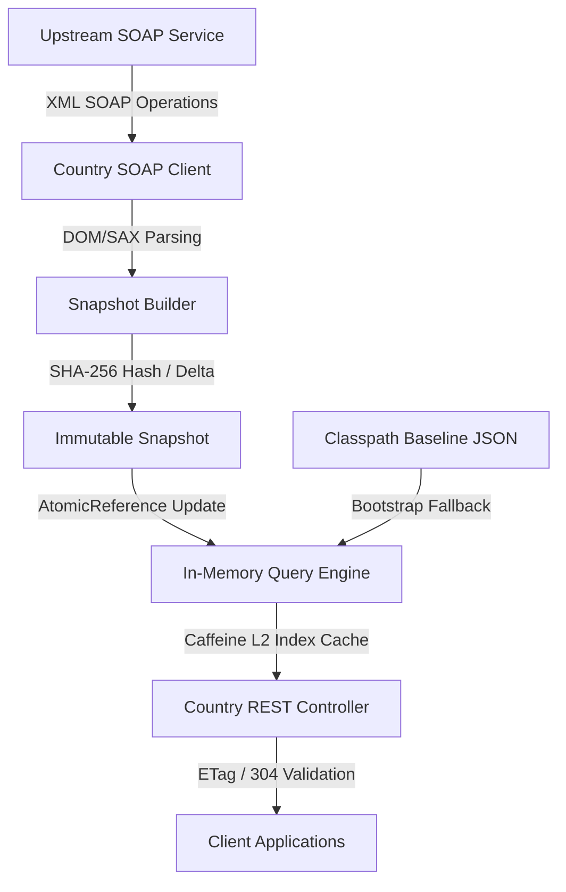

# Reference Data Aggregation Service (RDAS)

RDAS is a production-grade, high-performance, and resilient Spring Boot service designed to act as the single source of truth for country, currency, language, and geographical reference data at LOOP DFS. It aggregates and enriches static reference data from an upstream SOAP service, exposing a clean, fully-indexed REST/JSON API for downstream clients (Mobile, Web, and Portals).

---

## 📂 Project Documents Index

To help navigate the technical solution design, operations, and discussion deliverables:

* **Solution Architecture Design:** [architecture.md](file:///Users/paul/Documents/vibing/reference-data-aggregator/architecture.md) — Comprehensive technical overview of caching strategies, database-free data processing pipelines, and data flow structures.
* **Written Engineering Discussion Responses:** [engineering_discussion.md](file:///Users/paul/Documents/vibing/reference-data-aggregator/engineering_discussion.md) — Answers to assessments questions about scaling to 20M+ requests/day, downstream Kafka notifications, S3 shared cache state, and rate-limiting throttles.
* **Kubernetes Deployment & Troubleshooting Guide:** [deployment_and_troubleshooting_guide.md](file:///Users/paul/Documents/vibing/reference-data-aggregator/deployment_and_troubleshooting_guide.md) — Operational manual detailing cluster validation, containerization settings, resource scaling, and logs diagnosis.
* **Automated Postman Collection Guide:** [postman/README.md](file:///Users/paul/Documents/vibing/reference-data-aggregator/postman/README.md) — Guidelines to set up and execute automated endpoint tests using Newman/Postman.
* **Orchestration Deployment Script:** [deploy.sh](file:///Users/paul/Documents/vibing/reference-data-aggregator/deploy.sh) — Automates docker image builds and applies all Kubernetes manifests.
* **Docker Build Script:** [Dockerfile](file:///Users/paul/Documents/vibing/reference-data-aggregator/Dockerfile) — Hardened multi-stage JVM execution environment running as non-root user.

---


## 🏗️ Architecture & Core Invariants



To achieve high availability and strict performance SLAs, RDAS implements the following architectural invariants:
1. **Zero SOAP I/O on Request Paths:** All client requests are resolved completely in-memory using atomic references, eliminating network hops to the SOAP service during queries.
2. **Startup Resiliency:** During startup, if the SOAP service is unreachable, the system automatically falls back to bootstrap from a pre-packaged classpath baseline JSON dataset ([baseline-countries.json](file:///Users/paul/Documents/vibing/reference-data-aggregator/src/main/resources/baseline-countries.json)).
3. **XXE Security Hardening:** The internal SOAP parser is explicitly configured to disable doctype declarations (`disallow-doctype-decl`), shielding the system against XML External Entity attacks.
4. **Optimized Bandwidth with ETags:** Weak ETags (`W/"<hash>-fresh"` or `W/"<hash>-stale"`) are generated from the snapshot data hash. The service fully supports HTTP `304 Not Modified` conditional validation.
5. **Delta Audit Logging:** Every snapshot refresh evaluates the data SHA-256 hash. If changes are detected, a structured `AUDIT` log is emitted showing added, deleted, or updated countries.
6. **Stateful Kubernetes Resiliency:** Deployed as a Kubernetes `StatefulSet` with dedicated Persistent Volume Claims (PVC) mounted to `/data/snapshot/` to cache and restore snapshot states across pod Restarts.

---

## 🛠️ Tech Stack & Dependencies

* **Core:** Java 21 / Spring Boot 4.0.x
* **Cache Engine:** Concurrent In-Memory Indexes + Caffeine L2 Cache (for filtering & paging index structures)
* **Resiliency:** Resilience4j (Circuit Breaker, Rate Limiter, Retry on SOAP calls)
* **Observability:** Spring Boot Actuator + Micrometer + Prometheus scraping
* **API Documentation:** SpringDoc OpenAPI 3 / Swagger UI

---

## ⚙️ Configuration & Environment Variables

RDAS can be configured via standard properties in `application.yml` or through environment variables:

| Property | Environment Variable | Default Value | Description |
|---|---|---|---|
| `rdas.soap.endpoint` | `RDAS_SOAP_ENDPOINT` | `http://webservices.oorsprong...wso` | Upstream SOAP service URL |
| `rdas.cache.refresh-cron` | `RDAS_CACHE_REFRESH_CRON` | `0 0 */12 * * *` | Chron scheduling for background refreshes (default 12 hours) |
| `rdas.cache.retry-cron` | `RDAS_CACHE_RETRY_CRON` | `0 0 * * * *` | Hourly retry scheduling (active only if cache is in a degraded/stale state) |
| `rdas.cache.stale-threshold-hours` | `RDAS_CACHE_STALE_THRESHOLD_HOURS`| `48` | Threshold past which a snapshot is marked as stale |
| `rdas.cache.snapshot-path` | `RDAS_CACHE_SNAPSHOT_PATH` | `/tmp/rdas_snapshot.json` | Path where local copies of the active snapshot are persisted to disk |
| `rdas.query-cache.max-size` | `RDAS_QUERY_CACHE_MAX_SIZE` | `5000` | Caffeine query cache maximum size |
| `rdas.query-cache.ttl-minutes` | `RDAS_QUERY_CACHE_TTL_MINUTES` | `10` | Caffeine query cache TTL in minutes |

---

## 🚀 Getting Started (Local Development)

### Prerequisites
* Java 21 SDK
* Maven 3.9+

### Build the Application
Compile code and run automated JUnit tests:
```bash
mvn clean package
```

### Run the Application
Start the Spring Boot dev server locally:
```bash
mvn spring-boot:run
```
Once started, the server runs on port `8080`.

* **Interactive API Playground (Swagger UI):** `http://localhost:8080/swagger-ui.html`
* **Raw OpenAPI Specification:** `http://localhost:8080/api-docs`

---

## 📡 API Endpoints

All responses for `/countries` and `/countries/{isoCode}` are enveloped with metadata (`dataAsOf` and `stale` fields) and include ETag validation.

### Endpoints Table

| Method | Path | Summary | Query / Path Params |
|---|---|---|---|
| **GET** | `/api/v1/countries` | Search, filter, sort, and paginate countries | `name`, `continent`, `currency`, `language`, `sortBy` (default: `name`), `sortDir` (`asc`/`desc`), `page` (default `0`), `size` (default `20`) |
| **GET** | `/api/v1/countries/{isoCode}` | Get details of a single country | `{isoCode}` (e.g. `KE`) |
| **GET** | `/api/v1/currencies` | List all available currencies | None |
| **GET** | `/api/v1/currencies/{code}/countries`| List all countries using a currency | `{code}` (e.g. `KES`) |
| **GET** | `/api/v1/continents` | List all available continents | None |
| **GET** | `/api/v1/languages` | List all available languages | None |

### 🟢 Observability & Actuator

* **Liveness Probe:** `GET /actuator/health/liveness` (checks JVM status)
* **Readiness Probe:** `GET /actuator/health/readiness` (checks cache is populated and ready)
* **Prometheus Metrics:** `GET /actuator/prometheus`

---

## 🧪 Testing & Validation

### Automated Tests
Run the mock integration suite:
```bash
mvn test
```

### Postman Collections
An automated Postman collection is provided under the [postman/](file:///Users/paul/Documents/vibing/reference-data-aggregator/postman/) directory to verify and validate REST resources, test schema envelopes, run performance tests, and test ETag conditional validation automatically.

Refer to the [Postman Documentation README](file:///Users/paul/Documents/vibing/reference-data-aggregator/postman/README.md) for importing details and running tests with Newman.

---

## ☸️ Kubernetes Deployment

Deployment manifests are located in the [k8s/](file:///Users/paul/Documents/vibing/reference-data-aggregator/k8s/) directory:

* [statefulset.yaml](file:///Users/paul/Documents/vibing/reference-data-aggregator/k8s/statefulset.yaml): Deploys a 3-replica `StatefulSet` with individual persistent storage allocations for disk backups, service bindings, Horizontal Pod Autoscaling (HPA), and Pod Disruption Budgets (PDB).
* [configmap.yaml](file:///Users/paul/Documents/vibing/reference-data-aggregator/k8s/configmap.yaml): Houses default env configurations mapping onto Spring properties.

### Deployment & Troubleshooting Guides
For detailed steps on building the container image, deploying, and troubleshooting the live cluster environment:
* **Kubernetes Guide:** [deployment_and_troubleshooting_guide.md](file:///Users/paul/Documents/vibing/reference-data-aggregator/deployment_and_troubleshooting_guide.md) covers full deployment commands, cluster health checks, and detailed operational troubleshooting playbooks.
* **Orchestration Script:** [deploy.sh](file:///Users/paul/Documents/vibing/reference-data-aggregator/deploy.sh) builds the Docker image and deploys all resources to the cluster.

